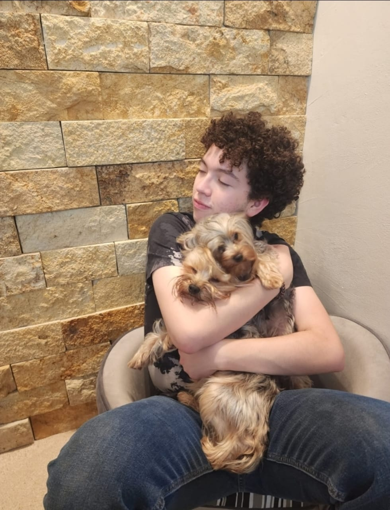
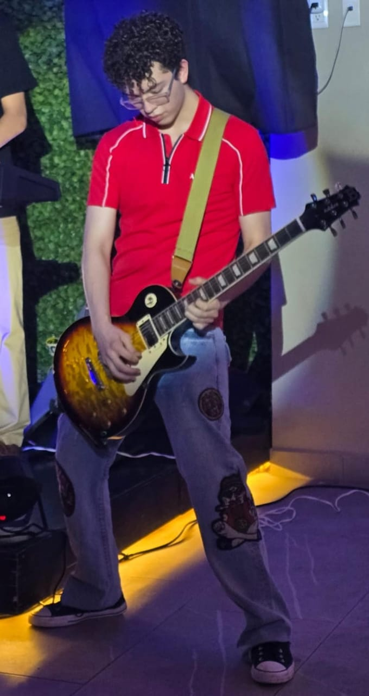

# Mi presentación
- **Nombre del proyecto:** _Mi Proyecto_  
- **Equipo / Autor(es):** _Mi nombre es Luis Ernesto Tamez Velazquez_  
- **Curso / Asignatura:** _Introducción a la mecatronica_  
- **Fecha:** _29/08/2025_  
- **Descripción breve:** Me llamo Luis Tamez, me gusta tocar la guitarra y me siento muy orgulloso de cómo la toco.

- ## Música
He tenido la oportunidad de tocar en varios lugares y disfrutar mucho de la experiencia.
Tambien me gusta mucho escuchar musica, me gusta mucho guns n roses y megadeth.

Actualmente estoy estudiando una ingeniería en la universidad iberoamericana de puebla, mi area de enfoque es la mecatrónica

## Me gustan mucho los animales

Tengo 4 mascotas

## Foto con mis perros

---

## Foto mia

---

## Contacto

Mi contacto es este:  
✉ [204109@iberopuebla.mx](mailto:204109@iberopuebla.mx)

---

¡Gracias por visitar mi página!
